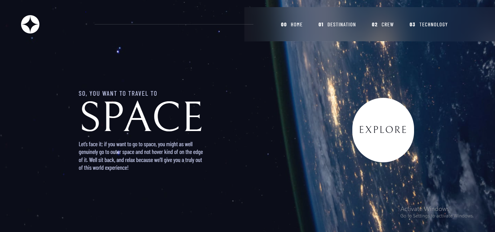

# Frontend Mentor - Space tourism website solution

This is a solution to the [Space tourism website challenge on Frontend Mentor](https://www.frontendmentor.io/challenges/space-tourism-multipage-website-gRWj1URZ3). Frontend Mentor challenges help you improve your coding skills by building realistic projects. 

## Table of contents

- [Overview](#overview)
  - [The challenge](#the-challenge)
  - [Links](#links)
- [💻 Getting Started](#getting-started)
- [My process](#my-process)
  - [Built with](#built-with)
  - [What I learned](#what-i-learned)
  - [Continued development](#continued-development)
- [Author](#author)


## Overview

### The challenge

Users should be able to:

- View the optimal layout for each of the website's pages depending on their device's screen size
- See hover states for all interactive elements on the page
- View each page and be able to toggle between the tabs to see new information

### Screenshot




### Links


- Live Site URL: [Add live site URL here](https://space-tourism-lozc.onrender.com)

## 💻 Getting Started <a name="getting-started"></a>


To get a local copy up and running, follow these steps.

### Prerequisites

In order to run this project you need:

- Code editor (preferably 'Vs code')
- NodeJs
- Git
- Browser

### Setup

Clone this repository to your desired folder:

```sh
  cd my-folder
  git clone https://github.com/Progress2002/space-tourism.git
```
-

### Install

Install this project with:

1. Install Node Modules

   ```sh
   npm install
   ```


### Usage

To run the project, execute the following command:

1. Generate a full static production build

   ```sh
   npm run build
   ```


2. Start the development server

   ```sh
   npm start

   ```


<p align="right">(<a href="#readme-top">back to top</a>)</p>


## My process

### Built with

- TailwindCSS
- React.js
- Mobile-first workflow


### What I learned

Working on this project:
- I got to fully understand state lifting in react
- I got to understand and use Tailwind css


If you want more help with writing markdown, we'd recommend checking out [The Markdown Guide](https://www.markdownguide.org/) to learn more.


### Continued development

- Add animations
- Add Booking page


👤 **Progress2002**

- GitHub: [@Progress2002](https://github.com/Progress2002)
- Twitter: [@Progress_2002](https://twitter.com/Progress_2002)
- LinkedIn: [@Progress](https://www.linkedin.com/in/progress-ezeamaka-27b114247)
- Frontend Mentor - [@Progress2002](https://www.frontendmentor.io/profile/progress2002)


## 🤝 Contributing <a name="contributing" id="contributing"></a>

Contributions, issues, and feature requests are welcome!

Feel free to check the [issues page](https://github.com/Progress2002/space-tourism/issues).


<!-- SUPPORT -->

## ⭐️ Show your support <a name="support" id="support"></a>


If you like this project please leave a star. Thank you 🙏

<p align="right">(<a href="#readme-top">back to top</a>)</p>

